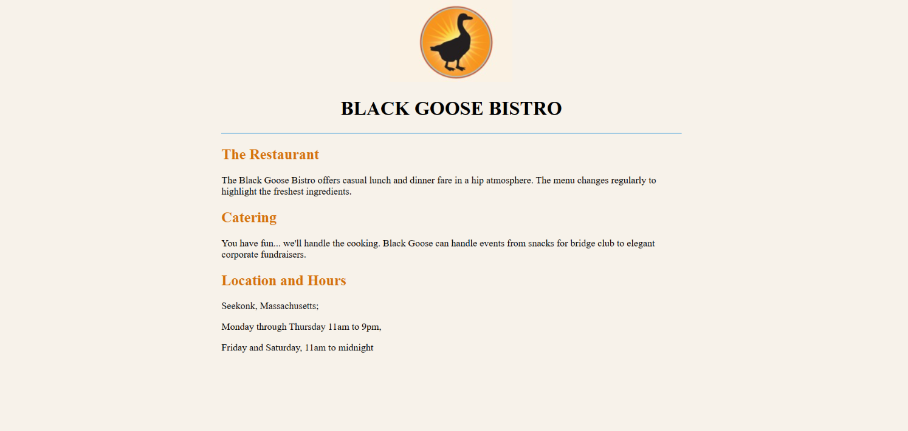

# 🍽️ Black Goose Bistro

A simple static restaurant webpage built as part of my **HTML practice** during the **ITI Web Development using Python & Generative AI** training.

## 📖 About the Project

**Black Goose Bistro** is a beginner-level static webpage designed to practice the fundamentals of **HTML5** and basic CSS styling.

The project presents a fictional restaurant with information about its services, location, opening hours, and a restaurant image.

## ✨ Features

* Restaurant introduction
* Restaurant description
* Catering information
* Location details
* Opening hours
* Restaurant image
* Structured HTML content
* Basic inline CSS styling

## 🛠️ Technologies Used

* **HTML5**
* **CSS3 (Inline CSS)**

## 📂 Project Structure

```text
Black_Goose_Bistro/
│
├── index.html
├── Goose Photo.jpeg
├── screenshots/
│   └── Black_Goose_Bistro.png
└── README.md
```

## 🎯 Learning Objectives

Through this project, I practiced:

* Creating a basic HTML5 document
* Using semantic HTML elements
* Working with headings and paragraphs
* Adding and displaying images
* Creating hyperlinks
* Organizing webpage content
* Structuring information into sections
* Applying basic CSS styling

## 📸 Project Preview



## 📚 Training

This project was completed as part of my **ITI Web Development using Python & Generative AI** training, within the **HTML & CSS** module.

---

**Part of my Web Development learning journey at ITI.**
