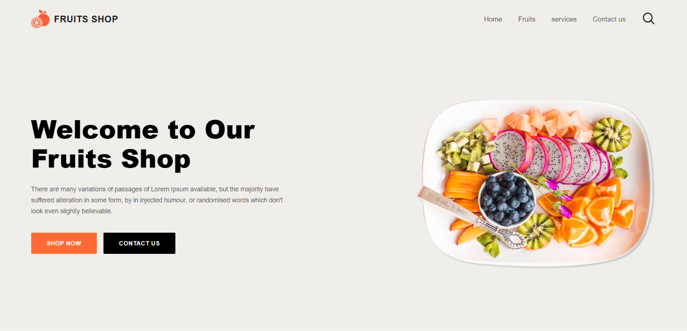
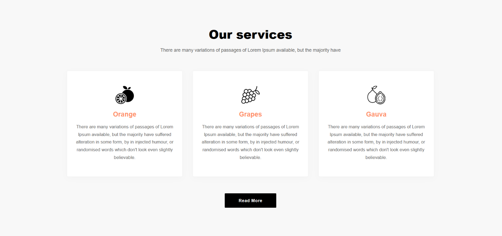
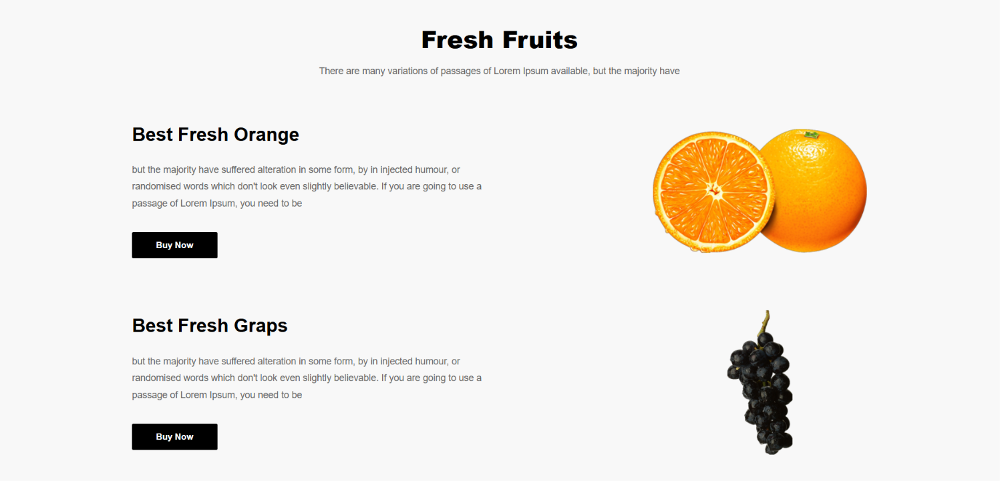
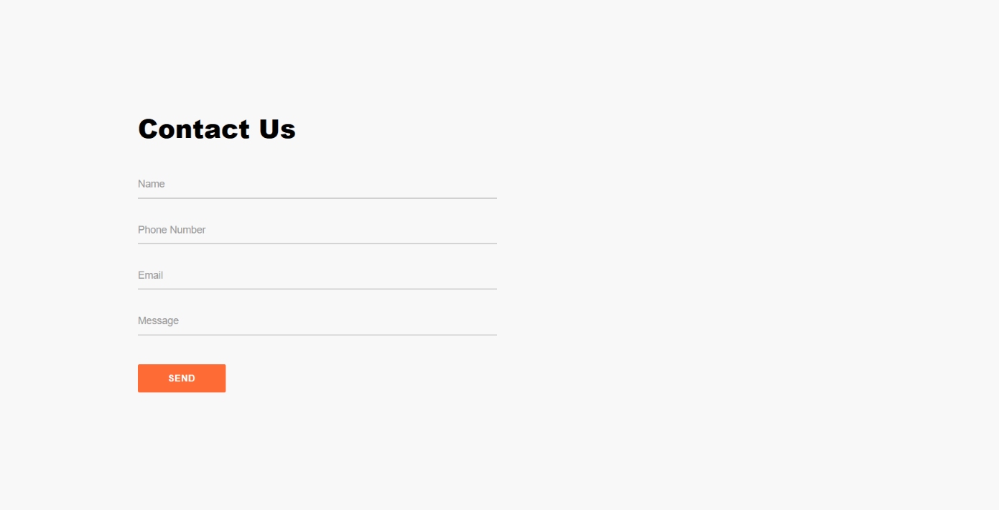

# 🍎 Fruits Shop

A simple and responsive fruits shop website built using **HTML5 and CSS3** as part of my Web Development training at ITI.

## 📸 Screenshots

### 🏠 Home



### 🛠️ Services



### 🍊 Fresh Fruits



### 📞 Contact



## 📌 About the Project

Fruits Shop is a static and responsive website designed to practice building and styling a simple e-commerce-style webpage.

The project focuses on creating a clean layout for displaying fruits, product information, and basic shop details.

## 🛠️ Technologies Used

* HTML5
* CSS3

## ✨ Features

* Responsive design
* Navigation bar with smooth scrolling
* Fruits products section
* Product images and information
* Services section
* Testimonial section
* Contact form
* Footer with social media links
* Hover effects and transitions
* Mobile, tablet, and desktop layouts

## 📚 Concepts Practiced

### HTML

* Semantic HTML
* Page structure
* Headings and paragraphs
* Images and alternative text
* Links
* Lists
* Sections
* Forms
* Buttons
* Navigation

### CSS

* CSS selectors
* Colors and typography
* Background images
* Box model
* Margin and padding
* Flexbox
* Positioning
* Transitions
* Hover effects
* Responsive design
* Media queries

## 📁 Project Structure

```text
Fruits_Shop/
│
├── images/
│   ├── logo.png
│   ├── dish.png
│   ├── orange.png
│   ├── grapes.png
│   ├── gauva.png
│   └── ...
│
├── screenshots/
│   ├── home.png
│   ├── services.png
│   ├── fruits.png
│   └── contact.png
│
├── index.html
├── style.css
└── README.md
```

## 🎯 Learning Goals

* Practice HTML and CSS fundamentals
* Build structured web pages
* Improve CSS layout and styling skills
* Practice responsive web design
* Build product-based layouts
* Apply frontend concepts in a practical project

## 👩‍💻 Author

**Yasmine Alaa**

GitHub: [Yasmine 3laa](https://github.com/Yasmin3laa)
