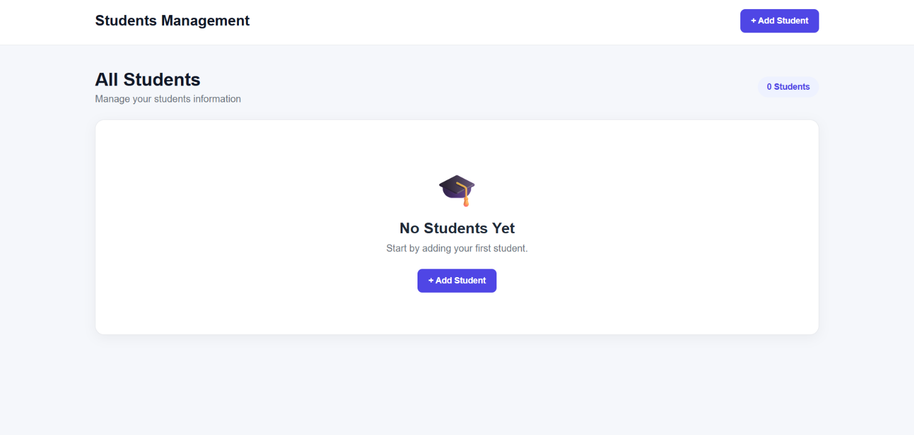
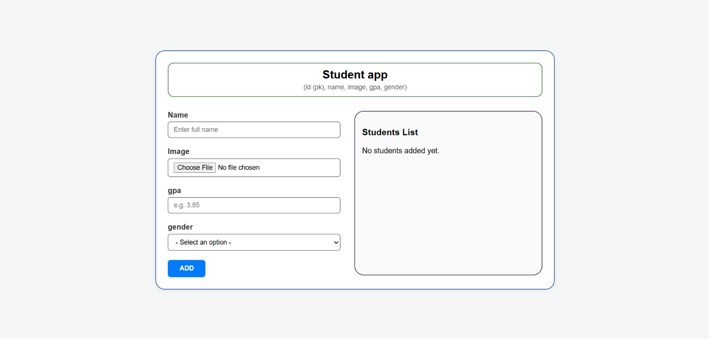
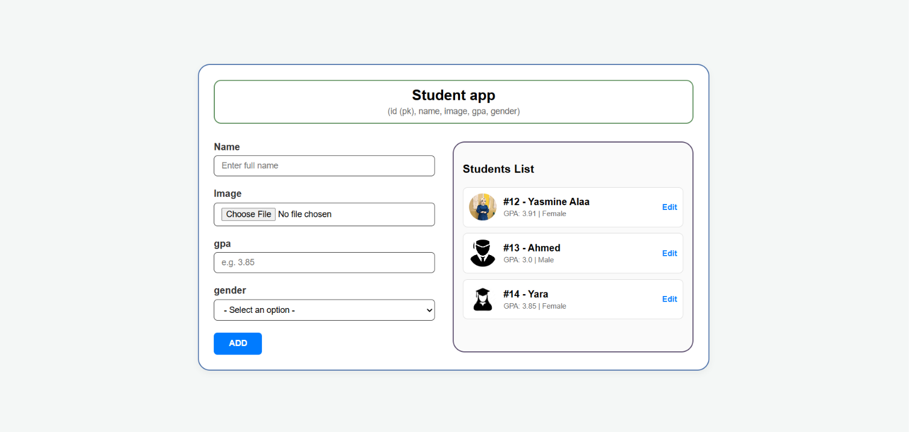
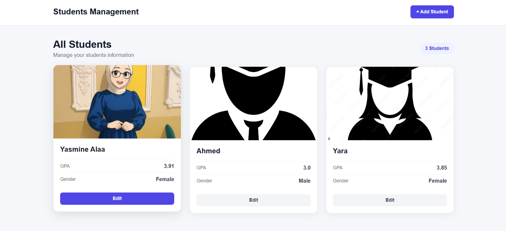

# 🎓 Students Management System

A web-based **Students Management System** built with **Django** to manage student records through a simple and organized interface.

This project was developed as part of my **Web Development training at ITI** to practice building database-driven web applications using Django.

## 📸 Screenshots

### 👨‍🎓 Students List



### ➕ Add Student



### ✏️ Update Student



### 👁️ Student Details



## ✨ Features

* Add new students
* Display student records
* View student details
* Update student information
* Delete student records
* Form validation
* Database integration
* Dynamic templates
* CRUD operations

## 🛠️ Technologies Used

* Python
* Django
* HTML5
* CSS3
* SQLite
* Django ORM

## 📚 Django Concepts Practiced

* Django project structure
* Django applications
* URL routing
* Views
* Templates
* Template inheritance
* Static files
* Models
* Django ORM
* Migrations
* Forms
* CRUD operations
* Database integration

## 🔄 CRUD Operations

| Operation | Description                      |
| --------- | -------------------------------- |
| Create    | Add a new student                |
| Read      | Display and view student records |
| Update    | Edit student information         |
| Delete    | Remove a student                 |

## 🗄️ Database

The project uses **SQLite** as the development database and **Django ORM** to interact with the database.

Student data is stored and managed through Django models and database migrations.

## 📁 Project Structure

```text
Students_Management_System/
│
├── students/
│   ├── migrations/
│   ├── templates/
│   ├── static/
│   ├── models.py
│   ├── views.py
│   ├── urls.py
│   └── ...
│
├── templates/
│
├── static/
│   └── css/
│
├── screenshots/
│   ├── students1.png
│   ├── students2.png
│   ├── students3.png
│   └── students4.png
│
├── manage.py
└── README.md
```

## 🎯 Purpose

This project was created as part of my **Django training at ITI** to practice building a CRUD-based web application and to understand how Django connects:

**Models → ORM → Views → Forms → Templates → Database**

## 🚀 Future Improvements

* Add student search
* Add filtering and sorting
* Add pagination
* Add authentication and user roles
* Improve UI/UX
* Add REST API support

## 👩‍💻 Author

**Yasmine Alaa**

GitHub: [Yasmine 3laa](https://github.com/Yasmin3laa)
