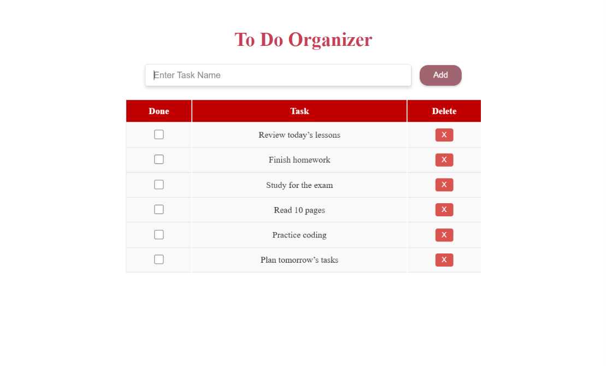
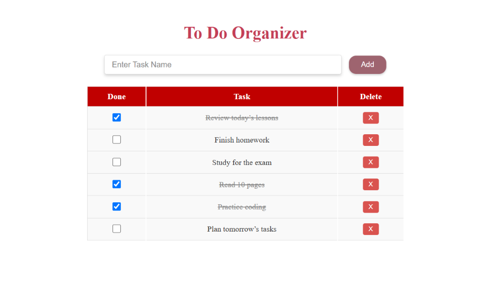

# 📝 To-Do List

An interactive To-Do List application built with **HTML5, CSS3, and JavaScript** as part of my Web Development training at **ITI**.

## 📌 About the Project

To-Do List is a simple task management application that allows users to add, complete, and delete tasks through an interactive user interface.

The project focuses on practicing **JavaScript DOM manipulation, event handling, arrays, objects, and dynamic HTML elements**.

## ✨ Features

* Add new tasks
* Display tasks dynamically
* Mark tasks as completed
* Delete tasks
* Interactive user interface
* Dynamic DOM manipulation
* Task state management

## 🛠️ Technologies Used

* HTML5
* CSS3
* JavaScript (ES6+)

## 📚 JavaScript Concepts Practiced

* DOM Manipulation
* Event Handling
* Functions
* Arrays
* Objects
* Loops
* Conditional Statements
* `addEventListener()`
* `createElement()`
* `appendChild()`
* `classList`
* Dynamic element creation
* Local data handling

## 📸 Screenshots

### Main Interface



### Tasks



## 📁 Project Structure

```text
To_Do_List/
├── screenshots/
├── index.html
├── style.css
├── script.js
└── README.md
```

## 🎯 Learning Goals

* Practice JavaScript fundamentals
* Understand DOM manipulation
* Work with browser events
* Build interactive web interfaces
* Improve problem-solving using JavaScript

## 📚 Training

This project was created as part of my **Web Development training at ITI**.
