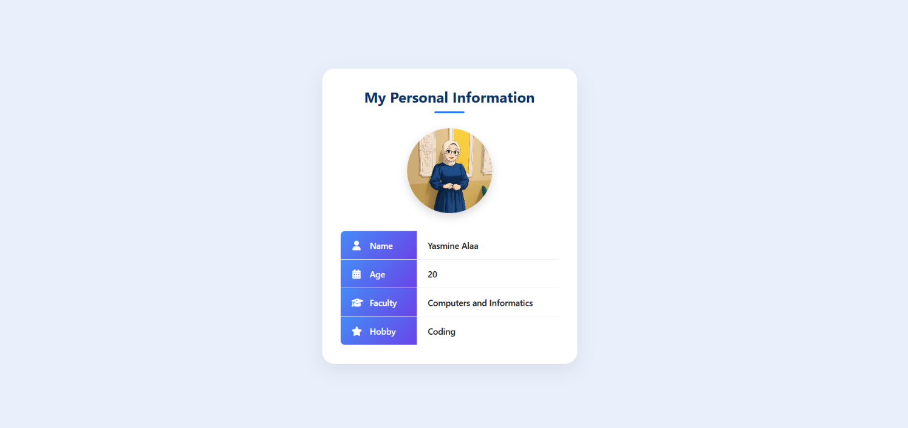

# 🪪 Personal Information Card

A simple and clean **Personal Information Card** built using **HTML5 and CSS3** as part of my **NTI Full Stack PHP** training.

## 📖 About the Project

This project is a simple personal information card designed to practice fundamental **HTML and CSS** concepts.

The card displays basic personal information in a clean and organized layout, along with a profile image and icons for each information field.

## ✨ Features

* Personal information display
* Profile image
* Styled information table
* Font Awesome icons
* Centered card layout
* Gradient label cells
* Rounded corners
* Box shadow
* Responsive viewport configuration
* Clean and organized UI

## 🛠️ Technologies Used

* **HTML5**
* **CSS3**
* **Font Awesome 6.4.0**

## 📂 Project Structure

```text
Personal_Information_Card/
│
├── index.html
├── style.css
├── photo.jpg
├── screenshots/
│   └── Personal_Information_Card.png
└── README.md
```

## 🧩 HTML Concepts Practiced

Through this project, I practiced:

* Creating a complete HTML5 document
* Using headings and paragraphs
* Working with images
* Creating and styling HTML tables
* Using `<div>` containers
* Adding external resources
* Using Font Awesome icons
* Organizing webpage content

## 🎨 CSS Concepts Practiced

### Layout

* `display: flex`
* `justify-content`
* `align-items`
* `min-height`

### Box Model

* `margin`
* `padding`
* `box-sizing`
* `width`
* `height`

### Styling

* `background-color`
* `color`
* `border`
* `border-radius`
* `box-shadow`
* `linear-gradient()`

### Typography

* `font-family`
* `font-size`
* `font-weight`
* `text-align`

### Other Concepts

* CSS selectors
* `object-fit`
* Pseudo-classes such as `:last-child`

## 📸 Project Preview



## 📚 What I Learned

Through this assignment, I practiced:

* Building a structured HTML page
* Linking an external CSS stylesheet
* Working with images and tables
* Creating a centered layout using Flexbox
* Using external icon libraries
* Applying gradients, shadows, and rounded corners
* Managing spacing using the CSS box model
* Creating a clean and organized user interface

## 🎯 Training

This project was completed as part of my **NTI Full Stack PHP** training, within the **HTML & CSS** module.

---

**Part of my Full Stack Web Development learning journey at NTI.**
