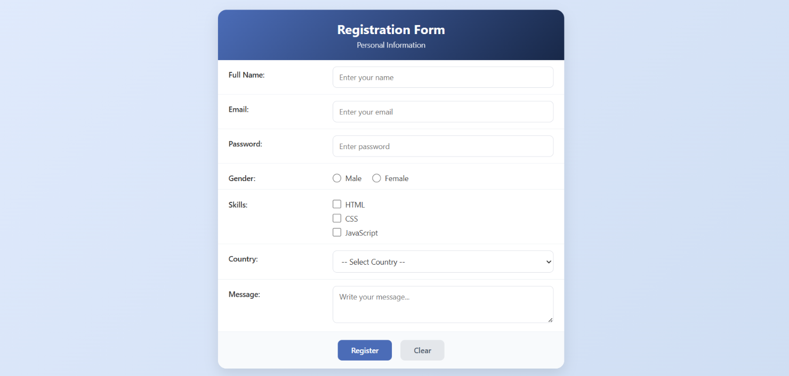

# 📝 Registration Form

A simple and clean **Registration Form** built using **HTML5 and CSS3** as part of my **NTI Full Stack PHP** training.

## 📖 About the Project

This project is a static registration form designed to practice fundamental **HTML form elements** and **CSS styling**.

The form provides a structured interface for users to enter their registration information using different input fields and form controls.

## ✨ Features

* User registration form
* Text input fields
* Email input
* Password input
* Radio buttons
* Checkboxes
* Select dropdown
* Submit button
* Form field styling
* Clean and organized layout
* Responsive viewport configuration

## 🛠️ Technologies Used

* **HTML5**
* **CSS3**

## 📂 Project Structure

```text
Registration_Form/
│
├── index.html
├── style.css
├── screenshots/
│   └── Registration_Form.png
└── README.md
```

## 🧩 HTML Concepts Practiced

Through this project, I practiced:

* Creating HTML5 forms
* Using the `<form>` element
* Working with `<input>` elements
* Using different input types
* Creating labels with `<label>`
* Using radio buttons and checkboxes
* Creating dropdown lists with `<select>`
* Using `<option>` elements
* Adding submit buttons
* Associating labels with form controls
* Organizing form fields

## 🎨 CSS Concepts Practiced

### Layout

* `display`
* `width`
* `margin`
* `padding`
* `box-sizing`

### Styling

* `background-color`
* `color`
* `border`
* `border-radius`
* `box-shadow`

### Typography

* `font-family`
* `font-size`
* `font-weight`
* `text-align`

### Form Styling

* Input field styling
* Button styling
* Label styling
* Radio button and checkbox styling
* Focus and interaction states

## 📸 Project Preview



## 📚 What I Learned

Through this assignment, I practiced:

* Building structured HTML forms
* Working with different form controls
* Connecting labels with input fields
* Styling form elements using CSS
* Creating a clean and organized form layout
* Managing spacing and alignment
* Improving the visual appearance of user input fields

## 🎯 Training

This project was completed as part of my **NTI Full Stack PHP** training, within the **HTML & CSS** module.

---

**Part of my Full Stack Web Development learning journey at NTI.**
