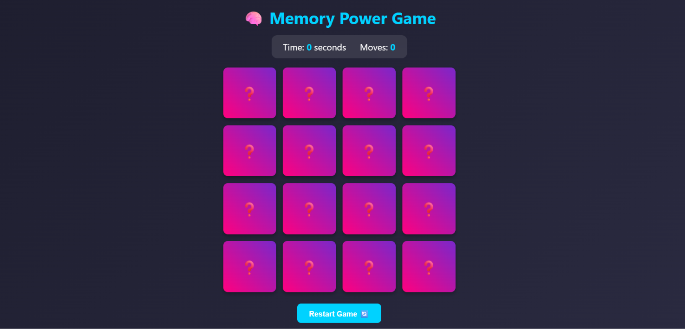
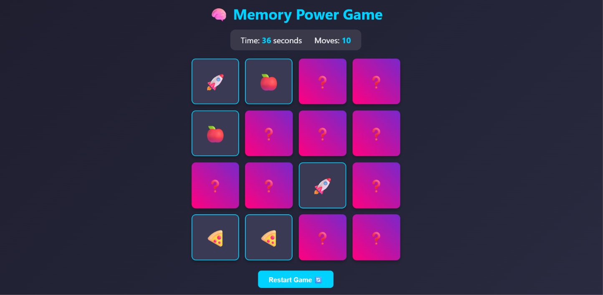
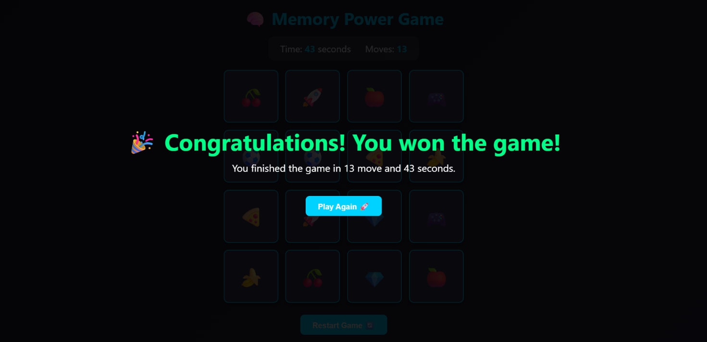

# 💛 JavaScript & jQuery

This directory contains my **JavaScript & jQuery training work** as part of the **NTI Full Stack PHP Training**.

The purpose of this module is to build a strong foundation in JavaScript, understand how websites become interactive, and practice using **jQuery** for DOM manipulation and event handling.

---

## 📚 About the Module

**JavaScript** is one of the core technologies of modern web development.
In this module, I practiced using JavaScript to create dynamic and interactive web pages.

I also learned **jQuery**, a JavaScript library that simplifies common tasks such as:

* DOM manipulation
* Event handling
* Animations
* Selecting HTML elements
* Working with forms
* Changing styles and classes
* Creating dynamic content

---

## 🛠️ Technologies

<p align="center">


</p>

---

## 📂 Folder Structure

```text
02_JavaScript&jQuery/
│
├── assignments/
│   │
│   └── Memory_Power_Game/
│       ├── screenshots/
│       ├── index.html
│       ├── style.css
│       ├── script.js
│       └── README.md
│
└── README.md
```

---

# 🧠 Topics Covered

## 1. JavaScript Fundamentals

The module covers the fundamentals required to start building interactive web applications.

### Variables

Understanding:

* `let`
* `const`
* `var`

```javascript
let username = "Yasmin";
const age = 20;
```

---

### Data Types

Working with common JavaScript data types:

* String
* Number
* Boolean
* Undefined
* Null
* Object
* Array

---

### Operators

Practicing:

* Arithmetic operators
* Comparison operators
* Logical operators
* Assignment operators
* Increment and decrement operators

---

## 2. Conditional Statements

Using conditions to control application behavior.

```javascript
if (condition) {
    // code
} else {
    // code
}
```

Also practicing:

* `if`
* `else`
* `else if`
* `switch`
* Ternary operator

---

## 3. Loops

Working with different types of loops:

* `for`
* `while`
* `do...while`
* `for...of`
* `for...in`

Example:

```javascript
for (let i = 0; i < 5; i++) {
    console.log(i);
}
```

---

## 4. Functions

Creating reusable blocks of code.

```javascript
function greet(name) {
    return `Hello ${name}`;
}
```

Topics include:

* Function declarations
* Function expressions
* Parameters
* Return values
* Arrow functions
* Callback functions

---

## 5. Arrays

Working with arrays and their common methods.

Examples:

```javascript
const numbers = [1, 2, 3, 4, 5];

numbers.push(6);
numbers.pop();
```

Practicing methods such as:

* `push()`
* `pop()`
* `shift()`
* `unshift()`
* `slice()`
* `splice()`
* `map()`
* `filter()`
* `forEach()`
* `find()`
* `includes()`

---

## 6. Objects

Understanding JavaScript objects and how to work with properties and methods.

```javascript
const student = {
    name: "Yasmin",
    track: "Full Stack PHP"
};
```

---

# 🌐 DOM Manipulation

One of the main goals of this module is learning how JavaScript interacts with HTML.

The **DOM (Document Object Model)** allows JavaScript to access and modify webpage elements dynamically.

Examples include:

* Selecting elements
* Changing text
* Changing HTML
* Changing attributes
* Adding and removing classes
* Creating elements
* Removing elements
* Changing styles

Example:

```javascript
const title = document.querySelector("h1");

title.textContent = "JavaScript & jQuery";
```

---

# 🖱️ Event Handling

Learning how to respond to user interactions.

Examples include:

* `click`
* `dblclick`
* `mouseover`
* `mouseout`
* `keydown`
* `keyup`
* `submit`
* `change`

Example:

```javascript
button.addEventListener("click", () => {
    console.log("Button clicked!");
});
```

---

# 💛 jQuery

After practicing JavaScript fundamentals and DOM manipulation, the module introduces **jQuery**.

jQuery provides a simpler syntax for many common JavaScript tasks.

### Selecting Elements

```javascript
$("p");
$(".container");
$("#title");
```

---

### Changing Content

```javascript
$("#title").text("Hello JavaScript");
```

---

### Changing HTML

```javascript
$("#content").html("<h2>Hello</h2>");
```

---

### CSS Manipulation

```javascript
$("#box").css("display", "none");
```

---

### Classes

```javascript
$("#box").addClass("active");
$("#box").removeClass("active");
$("#box").toggleClass("active");
```

---

### Events

```javascript
$("#button").on("click", function () {
    console.log("Clicked!");
});
```

---

# ✨ jQuery Effects

Practicing simple animations and effects such as:

* `show()`
* `hide()`
* `toggle()`
* `fadeIn()`
* `fadeOut()`
* `fadeToggle()`
* `slideUp()`
* `slideDown()`
* `slideToggle()`

Example:

```javascript
$("#box").fadeOut();
```

---

# 🎮 Assignments

The assignments section contains practical projects created while studying JavaScript & jQuery.

## 🧠 Memory Power Game

An interactive memory card game built using:

* HTML5
* CSS3
* JavaScript
* jQuery

### Features

* 🃏 16 cards
* 🔀 Randomized cards
* 🧠 Matching pairs
* ⏱️ Timer
* 🔢 Moves counter
* 🏆 Winning screen
* 🔄 Restart functionality
* 🎨 Interactive card UI

### Project Files

```text
Memory_Power_Game/
│
├── screenshots/
├── index.html
├── style.css
├── script.js
└── README.md
```

👉 [View Memory Power Game](assignments/Memory_Power_Game)

---

# 📸 Assignment Preview

<p align="center">
  
  
</p>

<p align="center">
  
</p>

---

# 🎯 Learning Objectives

The main objectives of this module are to understand how JavaScript and jQuery can be used to transform static HTML pages into interactive web applications.

By completing this module, I practiced how to:

* Write JavaScript code.
* Work with variables and data types.
* Use conditions and loops.
* Create reusable functions.
* Work with arrays and objects.
* Manipulate the DOM.
* Handle user events.
* Create dynamic HTML content.
* Manage UI states.
* Use jQuery selectors.
* Manipulate elements using jQuery.
* Handle events using jQuery.
* Create animations and effects.
* Build interactive browser-based applications.

---

# 💡 Practical Skills

This module helped me move from writing basic JavaScript code to applying JavaScript in real web interfaces.

The practical skills include:

```text
JavaScript
   │
   ├── Fundamentals
   ├── Functions
   ├── Arrays
   ├── Objects
   ├── DOM
   ├── Events
   └── Dynamic UI
          │
          ▼
       jQuery
          │
          ├── Selectors
          ├── Events
          ├── DOM Manipulation
          ├── Classes
          └── Effects
                  │
                  ▼
            Interactive Projects
```

---

# 🚀 What I Learned

Through this training, I learned how to connect:

**HTML + CSS + JavaScript + jQuery**

to create complete interactive experiences instead of static webpages.

The projects and assignments in this folder represent my practical application of the concepts covered during the **JavaScript & jQuery** part of the NTI Full Stack PHP training.

---

# 🎓 Training

### National Telecommunication Institute — NTI

**Track:** Full Stack PHP

**Module:** JavaScript & jQuery

---

## 👩‍💻 Author

### Yasmine 3laa

Full Stack Web Development Trainee

<p align="center">

<a href="https://github.com/Yasmin3laa">
  
</a>

</p>

---

## ⭐ Repository

This folder is part of my **Full Stack PHP training journey** and contains my JavaScript & jQuery learning materials and practical assignments.

**Made with ❤️ while learning and practicing Web Development.**
