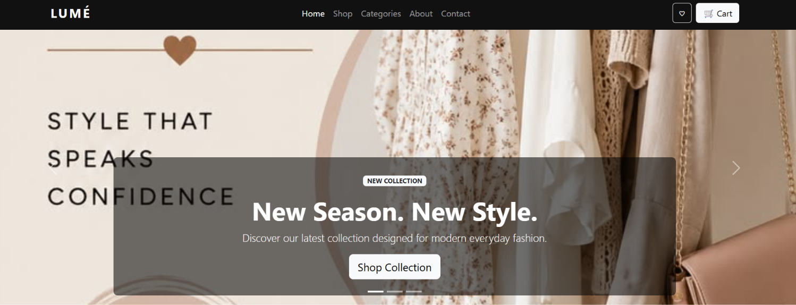
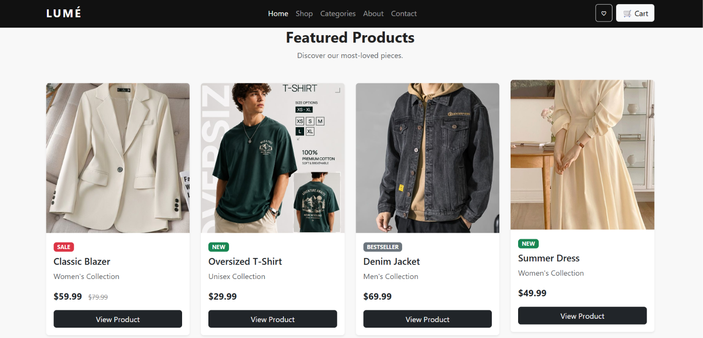
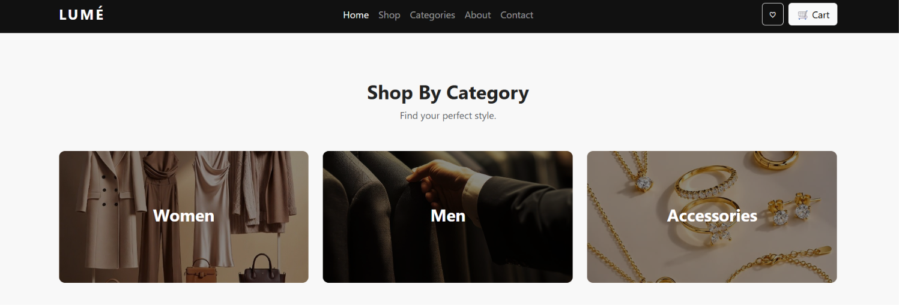
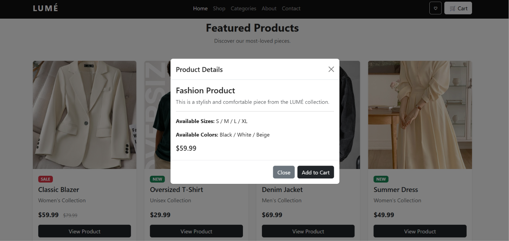
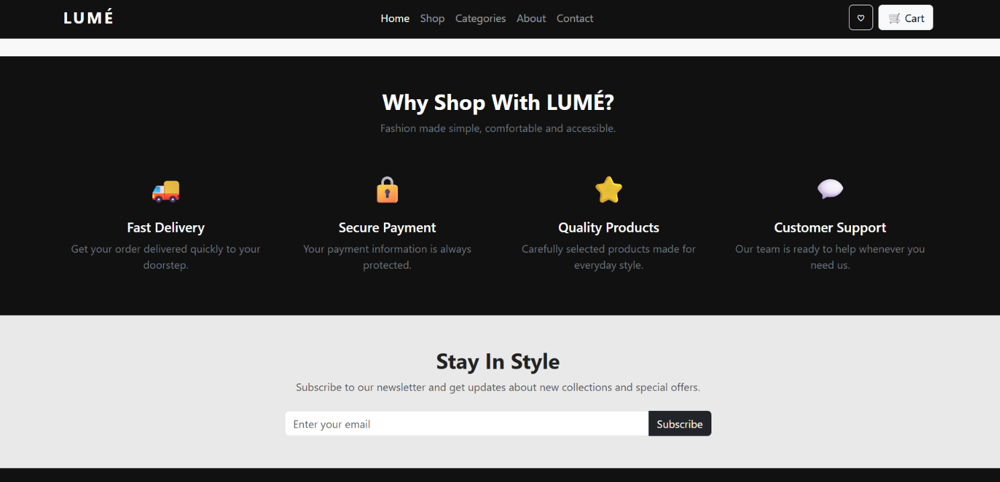

# 🛍️ LUMÉ — Fashion Store

A modern and responsive fashion store website built using **HTML5, CSS3, and Bootstrap 5**.

This project was created as part of the **NTI Full Stack PHP Training** to practice building responsive websites using Bootstrap components and its grid system.

---

## 📌 Project Overview

**LUMÉ** is a fictional modern fashion store that showcases clothing collections and fashion products in a clean and responsive layout.

The website provides users with an easy way to explore products, browse categories, view product details, and discover the latest fashion collections.

---

## ✨ Features

* 🏠 Responsive navigation bar
* 🎞️ Hero image carousel
* 👕 Featured products section
* 🛍️ Product cards
* 🏷️ Product badges
* 👗 Shop by category section
* 🪟 Product details modal
* ⭐ Why Shop With LUMÉ section
* 📧 Newsletter subscription form
* 📱 Fully responsive layout
* 🦶 Responsive footer

---

## 🛠️ Technologies Used

* **HTML5**
* **CSS3**
* **Bootstrap 5.3.2**
* **Bootstrap Grid System**
* **Bootstrap Navbar**
* **Bootstrap Carousel**
* **Bootstrap Cards**
* **Bootstrap Modal**
* **Bootstrap Badges**
* **Bootstrap Buttons**
* **Bootstrap Forms**
* **Responsive Web Design**

---

## 📂 Project Structure

```text
Fashon_Store/
│
├── assets/
│   └── ...
│
├── screenshots/
│   ├── home.png
│   ├── products.png
│   ├── categories.png
│   ├── modal.png
│   └── responsive.png
│
├── index.html
│
└── README.md
```

---

## 🏠 Website Sections

### 1. Navigation Bar

The website includes a responsive Bootstrap navbar with:

* LUMÉ logo
* Home
* Shop
* Categories
* About
* Contact
* Wishlist button
* Shopping cart button

The navbar also becomes responsive on smaller screens using the Bootstrap navbar toggler.

---

### 2. Hero Carousel

A Bootstrap carousel is used to display the latest fashion collections.

The carousel includes:

* Multiple slides
* Collection titles
* Descriptions
* Call-to-action buttons
* Previous and next controls
* Carousel indicators

Example:

> **New Season. New Style.**

> Discover our latest collection designed for modern everyday fashion.

---

### 3. Featured Products

The featured products section displays different clothing items using Bootstrap cards.

Each product card contains:

* Product image
* Product name
* Product category
* Product price
* Sale / New / Bestseller badge
* View Product button

Products include examples such as:

* Classic Blazer
* Oversized T-Shirt
* Denim Jacket
* Summer Dress

---

### 4. Shop By Category

Users can explore the store through different categories:

* 👩 Women
* 👨 Men
* 👜 Accessories

Each category is presented using a responsive Bootstrap grid layout.

---

### 5. Why Shop With LUMÉ?

This section highlights the benefits of shopping with the store:

* 🚚 **Fast Delivery**
* 🔒 **Secure Payment**
* ⭐ **Quality Products**
* 💬 **Customer Support**

---

### 6. Product Details Modal

A Bootstrap modal is used to display additional product information when the user clicks **View Product**.

The modal includes:

* Product information
* Available sizes
* Available colors
* Product price
* Add to Cart button
* Close button

---

### 7. Newsletter

The newsletter section allows visitors to subscribe using their email address.

It contains:

* Email input
* Subscribe button
* Short description

---

### 8. Footer

The footer contains:

* LUMÉ brand information
* Quick navigation links
* Contact information
* Copyright information

---

## 📱 Responsive Design

The website is designed to work across different screen sizes.

Bootstrap's responsive grid system is used to make the layout adapt to:

* 📱 Mobile devices
* 📲 Tablets
* 💻 Laptops
* 🖥️ Desktop screens

---

## 📸 Screenshots

### 🏠 Home Page



---

### 🛍️ Featured Products



---

### 👗 Categories



---

### 🪟 Product Details Modal



---

### 📱 About & Contact



---

## 🎯 Learning Objectives

This project was built to practice and understand the following Bootstrap concepts:

* Creating a responsive Navbar
* Building image Carousels
* Using the Bootstrap Grid System
* Creating responsive Product Cards
* Using Bootstrap Buttons
* Using Badges
* Creating and controlling Modals
* Building responsive Forms
* Using Bootstrap utility classes
* Combining Bootstrap with custom CSS
* Creating responsive layouts

---

## 👩‍💻 Author

**Yasmine 3laa**

Full Stack PHP Training — **NTI**

---

## 📄 License

This project was created for **educational purposes** as part of the NTI Full Stack PHP Training.
